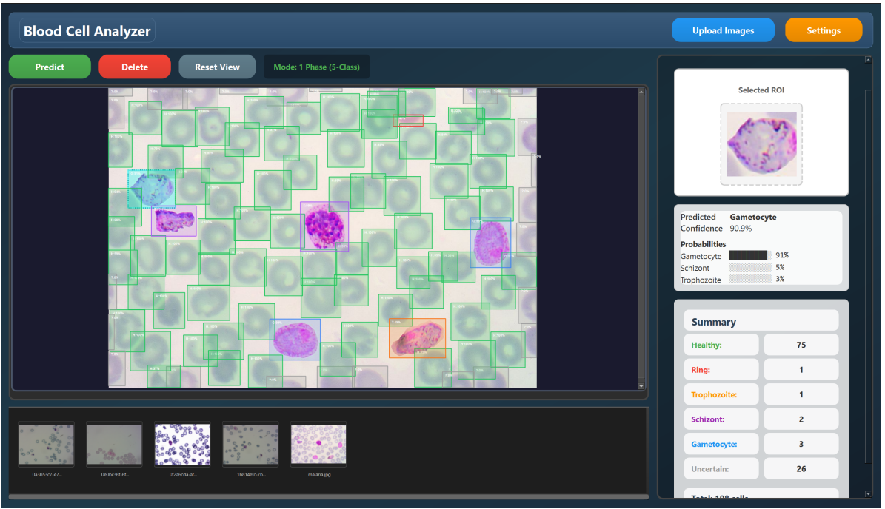

# 🔬 Blood Cell Analysis Application

A desktop application for automated malaria detection in blood cell microscopy images.

## Features

- **YOLO Cell Detection**: Automatically detects individual blood cells in microscopy images
- **Two Classification Modes**:
  - **1-Phase**: Direct 5-class classification (Healthy, Ring, Trophozoite, Schizont, Gametocyte)
  - **2-Phase**: Binary classification (Healthy vs Infected) followed by stage classification
- **Interactive Viewer**: Zoom, pan, and click on detected cells to see detailed results
- **Batch Processing**: Upload and analyze multiple images
- **Result Summary**: View cell counts by category

## Screenshots



**Key UI features:**
- Modern dark-themed interface
- Color-coded bounding boxes per cell type (Green=Healthy, Red=Ring, Orange=Trophozoite, Purple=Schizont, Blue=Gametocyte)
- Interactive ROI selection with per-class confidence probabilities
- Summary panel with cell counts by category
- Thumbnail bar for navigating uploaded images

## Installation

### Quick Setup (Windows)

1. Double-click `setup.bat`
2. Wait for dependencies to install
3. Download model weights when prompted (or manually place them)
4. Double-click `run_app.bat` to launch

### Manual Setup

1. **Install Python 3.9+** from [python.org](https://python.org)

2. **Install dependencies**:
   ```bash
   pip install -r requirements.txt
   ```

3. **Download model weights** from:
   [Google Drive Link](https://drive.google.com/drive/folders/1tMoGcmDaeWYd7ZKRwL7prrVXOGkxaHLX)

4. **Place weights** in the following structure:
   ```
   Weights/
   ├── Yolo/
   │   └── yolo11l.pt
   └── ConvNext/
       ├── 1Phase/
       │   └── 1Phase.pth
       └── 2Phase/
           ├── Phase1.pth
           └── Phase2.pth
   ```

5. **Run the application**:
   ```bash
   python main.py
   ```

## Usage

1. **Upload Images**: Click "Upload Images" to add microscopy images
2. **Select an Image**: Click a thumbnail in the bottom bar
3. **Run Prediction**: Click "Predict" to analyze the image
4. **View Results**: 
   - Bounding boxes appear around detected cells
   - Click on a cell to see classification details
   - View summary counts in the right panel
5. **Change Mode**: Click "Settings" to switch between 1-Phase and 2-Phase classification

## File Structure

```
Application/
├── main.py              # Entry point
├── setup_app.py         # Setup script
├── requirements.txt     # Python dependencies
├── setup.bat            # Windows setup launcher
├── run_app.bat          # Windows app launcher
├── core/
│   ├── config.py        # Configuration
│   ├── models.py        # Neural network definitions
│   └── pipeline.py      # Analysis pipeline
├── gui/
│   ├── main_window.py   # Main application window
│   ├── image_viewer.py  # Image display with bounding boxes
│   └── widgets.py       # Custom UI widgets
├── Data/
│   ├── Input/           # Uploaded images
│   └── Output/          # Prediction results (JSON)
└── Weights/
    ├── Yolo/            # YOLO detection model
    └── ConvNext/        # Classification models
        ├── 1Phase/      # 5-class model
        └── 2Phase/      # Binary + Stage models
```

## Models

### YOLO v11
- Detects individual blood cells in microscopy images
- Returns bounding boxes for each detected cell

### ConvNeXt V2 (backbone: `convnextv2_tiny` + GeM Pooling)
- **1-Phase**: Direct 5-class classifier — Healthy, Ring, Trophozoite, Schizont, Gametocyte
- **2-Phase Stage 1**: Binary classifier — Healthy vs Infected
- **2-Phase Stage 2**: 4-class stage classifier — Ring, Trophozoite, Schizont, Gametocyte


## Dataset

Training integrates **5 public malaria microscopy datasets** to maximize diversity and robustness:

| Dataset | Source | Images | Species |
|---------|--------|--------|---------|
| **BBBC041-v1** | [Broad Bioimage Benchmark Collection](https://bbbc.broadinstitute.org/BBBC041/) | 79,305 train + 5,917 test | *P. vivax* |
| **IML Dataset** | [Kaggle — IML Malaria Dataset](https://www.kaggle.com/) | 38,449 | *P. falciparum* + *P. vivax* |
| **Gambia Dataset** | [Mendeley Data](https://data.mendeley.com/) | 2,921 | *P. falciparum* |
| **Plasmodium2019** | Plasmodium2019 Malaria Segmentation Dataset | 2,846 | *P. falciparum* |
| **MP-IDB** | [DatasetNinja — MP-IDB](https://datasetninja.com/) | 1,407 | Multi-species |

- **Classes**: Healthy, Ring, Trophozoite, Schizont, Gametocyte
- **Preprocessing**: Cell-level crop via YOLO → Resize 256×256 → Normalize (mean/std from dataset)

## Requirements

- Python 3.9+
- PyQt6
- PyTorch
- Ultralytics (YOLO)
- timm (PyTorch Image Models)
- OpenCV
- Pillow
